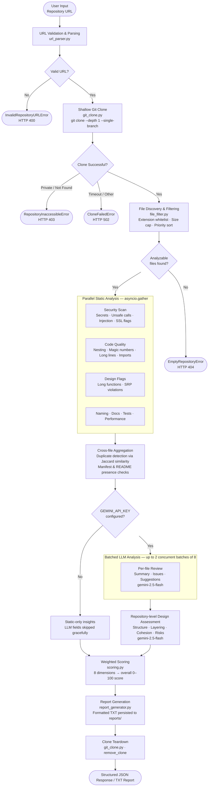

# Code Analyzer

A hybrid static-analysis and LLM-powered tool that evaluates the quality of any public GitHub repository and produces a structured, scored report.

---

## Overview

Code Analyzer accepts a GitHub repository URL, performs a shallow clone, filters relevant source files, runs multi-dimensional static analysis in parallel, and sends the results to Gemini 2.5 Flash for per-file and repository-level reasoning. The combined output is distilled into an overall quality score across eight weighted dimensions and persisted as a JSON report.

The tool solves a common developer problem: rapidly assessing unfamiliar codebases for security risks, code quality issues, design anti-patterns, and documentation gaps without manually auditing every file. It is useful for code review automation, onboarding audits, and open-source due diligence.

---

## Features

- Shallow git clone (`--depth 1 --single-branch`) for fast repository acquisition
- Multi-dimensional static analysis with no external linter dependencies
- Parallel per-file analysis via `asyncio.gather` backed by `asyncio.to_thread`
- Python AST-based deep analysis: unused imports, undocumented functions, long functions, naming violations
- Security scanning: hardcoded secrets, unsafe calls (`eval`, `exec`, `pickle.loads`, unsafe `subprocess`), injection patterns, insecure configuration flags
- Cross-file duplicate detection using Jaccard similarity on normalized lines
- Batched LLM analysis via `google-generativeai` with concurrency control and per-file fallback
- Repository-level design assessment generated by a software architect prompt
- Weighted scoring across eight dimensions producing a 0-100 overall score
- Report generation perfectly structured to a formatted TXT output (.txt) persisted to disk
- Token Usage & Cost Estimation explicitly calculated and shown per repository run
- REST API (FastAPI) and CLI entry points
- Graceful degradation: full static analysis runs without a `GEMINI_API_KEY`

---

## Architecture

The system follows a sequential pipeline with two parallel stages internally:



The pipeline combines two complementary approaches:

- **Static analysis**: Deterministic regex and AST-based heuristics that run without network access and produce reproducible findings per file.
- **LLM reasoning**: Gemini 2.5 Flash provides natural-language summaries, issues, and suggestions for each file, as well as a concise repository-level design assessment.
- **Token Estimation**: Input and output sizes are approximated systematically to determine a final USD cost estimation on every run.

---

## Tech Stack

| Component | Technology |
|---|---|
| Backend framework | FastAPI 0.115+ |
| ASGI server | Uvicorn |
| Configuration | Pydantic Settings |
| LLM | Gemini 2.5 Flash (`gemini-2.5-flash`) via `google-generativeai` |
| Python requirement | 3.11+ |
| Languages analyzed | Python, JavaScript, TypeScript, Java, Go, C, C++, Rust, YAML, Markdown, Dockerfile |
| Build system | setuptools (pyproject.toml) |

---

## How It Works

**Step 1 - Accept input**

The repository URL is validated and parsed to extract the owner and repository name.

**Step 2 - Shallow clone**

The repository is cloned with `git clone --depth 1 --single-branch` into a temporary working directory (`temp_repos/`). A configurable timeout (default 600 seconds) bounds the operation.

**Step 3 - File filtering**

Files are selected by extension (`.py`, `.js`, `.ts`, `.java`, `.go`, `.cpp`, `.c`, `.rs`, `.yml`, `.yaml`, `.md`, `Dockerfile`). Files exceeding 1 MB, minified bundles (`.min.`, `.bundle.`), images, front-end style files, and build output directories (`node_modules`, `dist`, `build`, `target`, `.next`, `vendor`) are excluded. Files are sorted to prioritize core backend paths (`src/`, `app/`, `backend/`, `services/`) over documentation.

**Step 4 - Static analysis**

Each retained file is analyzed in a thread pool. Analysis covers security patterns, code quality indicators, naming conventions, design flags, documentation coverage, dependency configuration, test identification, and performance hints. Python files receive additional AST-based analysis.

**Step 5 - LLM analysis**

Up to 150 prioritized files are sent to Gemini 2.5 Flash in concurrent batches. Each file is truncated to bounded character limits before sending. If a batch fails, the system falls back to per-file requests. LLM analysis is skipped gracefully if `GEMINI_API_KEY` is not set. The total token usage and costs are computed dynamically based on the amount of content processed.

**Step 6 - Scoring**

Eight dimension scores are computed from static aggregate data and combined using fixed weights into an overall score.

**Step 7 - Report generation**

The full result is constructed into a highly structured 8-section Markdown-like Text profile and written to `<repo_name>_report.txt` in the `reports/` directory. The clone directory is permanently deleted immediately after the metadata response is assembled.

---

## Installation

**Prerequisites**

- Python 3.11 or later
- Git installed and available on `PATH`

**Install dependencies**

```bash
pip install -r requirements.txt
```

**Or install as a package**

```bash
pip install -e .
```

**Configure environment**

Copy the example environment file and set your Gemini API key:

```bash
cp .env.example .env
```

Edit `.env`:

```
GEMINI_API_KEY=your_google_ai_api_key_here
```

The tool runs without a key, but LLM-based insights will be skipped.

---

## Usage

### REST API

Start the server:

```bash
uvicorn app.main:app --host 0.0.0.0 --port 8000
```

Or using the package entry point:

```bash
python -m app
```

**Endpoints**

| Method | Path | Description |
|---|---|---|
| GET | `/health` | Health check |
| GET | `/analyze?repo_url=<url>&depth=full` | Analyze a repository (depth can be `full` or `basic`) |

**Example request**

```bash
curl "http://localhost:8000/analyze?repo_url=https://github.com/owner/repository&depth=basic"
```

### CLI

```bash
code-analyzer https://github.com/owner/repository
```

Print the full result as JSON:

```bash
code-analyzer https://github.com/owner/repository --json
```

Enable debug logging:

```bash
code-analyzer https://github.com/owner/repository -v
```

Fast, static-only analysis mode:

```bash
code-analyzer https://github.com/owner/repository --basic
```

---

## Example Output

```json
{
  "success": true,
  "repository": "owner/repository",
  "owner": "owner",
  "repo_name": "repository",
  "report_file": "/absolute/path/to/reports/repository.json",
  "overall_score": 74.35,
  "scores": {
    "security": 88.0,
    "code_quality": 76.0,
    "design": 70.0,
    "structure": 65.0,
    "naming": 90.0,
    "documentation": 55.0,
    "testing": 40.0,
    "performance": 100.0
  },
  "weights_applied": {
    "security": 0.3,
    "code_quality": 0.2,
    "design": 0.15,
    "structure": 0.1,
    "naming": 0.1,
    "documentation": 0.05,
    "testing": 0.05,
    "performance": 0.05
  },
  "issues_found": [
    "[Security] src/db.py: Possible injection risk (string-built query or command)",
    "[Quality] src/handler.py: Deep nesting / indentation (approx depth 6)",
    "[Documentation] No README.md found at repository root",
    "[Testing] No obvious test files or test directories detected"
  ],
  "design_summary": "The repository follows a service-oriented layout with clear separation between API handlers and data access layers. Some modules show signs of growing beyond a single responsibility...",
  "file_insights": [
    {
      "path": "src/db.py",
      "summary": "Database access layer using raw SQL with string concatenation.",
      "issues": ["String-built queries expose SQL injection risk"],
      "suggestions": ["Use parameterized queries or an ORM"]
    }
  ],
  "repo_level_insights": "The repository follows a service-oriented layout...",
  "total_input_tokens": 125000,
  "total_output_tokens": 4200,
  "estimated_cost_usd": 0.01063,
  "metadata": {
    "files_analyzed": 32,
    "files_considered": 78,
    "llm_enabled": true,
    "analysis_mode": "git_clone"
  }
}
```

---

## Scoring System

All dimension scores are on a 0-100 scale and are capped to prevent runaway penalties on a single dimension. The overall score is a weighted sum.

| Dimension | Weight | Basis |
|---|---|---|
| Security | 30% | Hardcoded secrets, unsafe calls (`eval`, `exec`, `pickle.loads`, shell-mode subprocess), injection patterns, insecure debug/SSL flags |
| Code Quality | 20% | Deep nesting (indent depth >= 5), excessive magic numbers, very long lines (> 140 chars), Python syntax errors, unused imports |
| Design | 15% | Very long functions (> 80 lines), single modules with many functions and few classes, high function count in non-Python files |
| Structure | 10% | Presence of dependency manifests (`requirements.txt`, `package.json`, `go.mod`, `pom.xml`), layered folder structure, duplicate file pairs |
| Naming | 10% | Single-character identifiers (Python AST), mixed `snake_case`/`camelCase` in the same file |
| Documentation | 5% | Python function docstring coverage below 25%, sparse comments in JS/TS/Java/Go, missing README at repository root |
| Testing | 5% | Count of detected test files in paths matching `tests/`, `test/`, `__tests__`, `_test.py`, `.test.`, `.spec.` |
| Performance | 5% | Nested loops, blocking `time.sleep` calls, repeated list `.append` inside `while` loops |

---

## Project Structure

```
Code Analyzer/
├── app/
│   ├── __main__.py          # Package entry point (python -m app)
│   ├── cli.py               # CLI entry point (argparse + asyncio)
│   ├── main.py              # FastAPI application and /analyze route
│   ├── config.py            # Pydantic Settings loaded from .env
│   ├── exceptions.py        # Domain-specific exception hierarchy
│   ├── models.py            # Pydantic response and data models
│   └── services/
│       ├── clone_analyze_service.py  # Orchestrates clone pipeline end-to-end
│       ├── pipeline_core.py          # Shared hybrid analysis pipeline (static + LLM + report)
│       ├── git_clone.py              # Shallow clone, error classification, teardown
│       ├── file_filter.py            # Extension rules, exclusion lists, priority sorting
│       ├── static_analyzer.py        # Per-file and aggregate static analysis
│       ├── llm_service.py            # GeminiAnalyzer: per-file batch and repo-level design
│       ├── scoring.py                # Weighted score computation from static aggregate
│       ├── report_generator.py       # Exact 8-section TXT report builder
│       ├── url_parser.py             # GitHub URL validation and parsing
│       └── local_discovery.py        # Local filesystem file discovery
├── reports/                 # Generated structured TXT reports
├── temp_repos/              # Temporary clone workspace (git-ignored, auto-cleaned)
├── .env.example             # Environment variable template
├── requirements.txt         # Direct runtime dependencies
└── pyproject.toml           # Package metadata and entry points
```

---

## Error Handling

| Condition | Exception | HTTP Status | CLI Exit Code |
|---|---|---|---|
| Malformed or non-GitHub URL | `InvalidRepositoryURLError` | 400 | 2 |
| Private, missing, or auth-blocked repository | `RepositoryInaccessibleError` | 403 | 3 |
| Git clone failure (timeout, disk, network) | `CloneFailedError` | 502 | 4 |
| Repository has no analyzable files | `EmptyRepositoryError` | 404 | 5 |
| General analyzer failure | `AnalyzerError` | 502 | 1 |
| Unexpected internal error | `Exception` | 500 | - |

All errors are returned as structured JSON objects with `success: false`, an `error` message, and a machine-readable `code` string.

---

## Performance Considerations

- **Shallow clone**: `--depth 1 --single-branch --no-tags` fetches only the minimal baseline commit.
- **File cap**: At most 150 files are retained and prioritized automatically based on heuristics.
- **Parallel static analysis**: All files are analyzed concurrently in a thread pool via `asyncio.gather`.
- **Batched LLM calls**: Files are grouped into batches to balance throughput against API rate limits seamlessly.
- **Content truncation**: File content sent to the LLM is truncated gracefully to prevent context bleeds.
- **Clone teardown**: The cloned directory is rigorously deleted immediately after analysis.

---

## Limitations

- Only public GitHub repositories are supported. Authentication for private repositories is not implemented.
- The API rate limit and token budget of the Gemini API are not managed automatically beyond the concurrency semaphore.
- Static analysis heuristics are approximations; they do not replace a dedicated linter or security scanner.
- Cross-file duplicate detection uses Jaccard similarity on normalized lines, which may produce false positives on boilerplate-heavy codebases.
- Front-end files (HTML, CSS, JSX, TSX, Vue) are intentionally excluded from analysis.
- The tool does not execute any code in the repository.

---

## Future Improvements

- Support for GitLab and Bitbucket repository URLs
- Authenticated cloning for private repositories via token injection
- Streaming progress updates over Server-Sent Events or WebSocket
- Per-language pluggable analyzer modules (e.g., integrating `eslint` for JavaScript)
- Historical score tracking across multiple runs with diff reporting
- Configurable weight profiles to adjust scoring emphasis per use case
- Containerized deployment with Docker Compose

---

## Contributing

1. Fork the repository and create a feature branch from `main`.
2. Keep changes focused. One feature or fix per pull request.
3. Add or update tests where applicable.
4. Ensure the project installs cleanly via `pip install -e .`.
5. Open a pull request with a clear description of the change and its motivation.

---

## License

No license file is currently present in this repository. All rights are reserved by the author until a license is explicitly defined.
